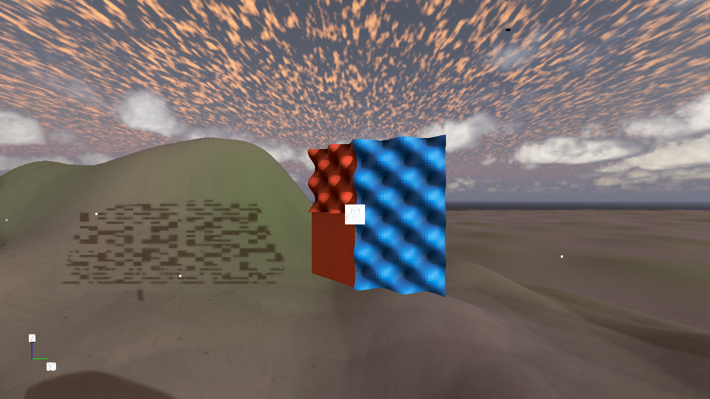
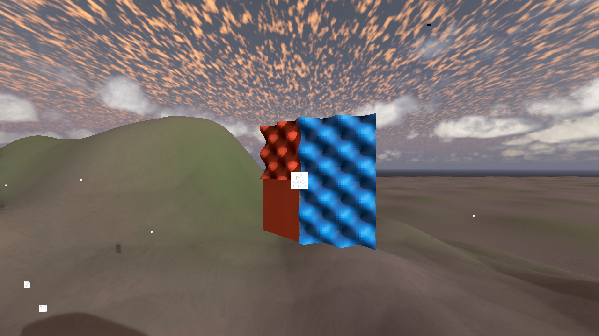

# Terrain shadow blocks: issue #6

The responsible pass is Atom's `MainPipeline_0.Shadows.FullscreenShadowPass`.
`DirectionalShadowCalculator::GetShadowCascadeRange` can return
`maxShadowCascade == cascadeCount` when a receiver is inside a cascade's XY
footprint but beyond every remaining far plane. Its consumers iterate through
that **inclusive** upper index. They read uninitialized coordinates and sample an
inactive array slice; with four cascades, the coordinate index is out of bounds
as well. On the RX 7900 XTX this appeared as changing horizontal blocks on terrain.

The short, one-cascade/20-metre configuration in the planar fixture exposes the
bug. The terrain is the receiver, and no mesh caster is required to reproduce it.
Neither SilPOM height intersection nor DisplacementPBR produces these blocks.

The TGProject fix stops the range search at the last active cascade, retaining
earlier cascades that can legitimately contain occluders for the receiver. It
does not discard the entire range when the receiver is beyond the final far
plane. The fix is in the consuming project:

- `ShaderLib/Atom/Features/Shadow/DirectionalLightShadowCalculator.azsli`
- `Shaders/Shadow/FullscreenShadow.azsl` and `.shader` (stock fullscreen shader
  with an explicit include of the fixed helper)
- `Gem/Tests/DirectionalShadowCascadeGpuTests.cpp`

These are maintained project overrides of O3DE revision
`061180bf24f1666eb30315b35da292eb14f4659c`. The engine checkout and SilPOM surface
shaders are unchanged. The override covers the fullscreen pass and its NoMSAA
supervariant; it does not globally replace other engine calculator consumers.

## Isolation and evidence

On 2026-09-20, DX12, Radeon RX 7900 XTX, `DefaultLevel`:

| Comparison | Result |
| --- | --- |
| Fresh planar fixture baseline | Blocks reproduced |
| Disable each candidate component, including the FBX fixture | Blocks remain |
| Disable all seven Mesh/SilPOM Mesh/SilPOM Patch components | Blocks remain |
| Disable directional shadows | Blocks disappear |
| Disable filtering or receiver plane bias | Not a fix |
| Shadow bias 0.0015, 0.05, 0.2, 1; normal bias 0, 2.5, 10; map size 2048 | Not a fix |
| Raw cascaded shadow depth | No corresponding blocks |
| Fullscreen shadow attachment | Blocks are present before forward lighting |
| Bound the cascade range | Blocks disappear; real shadows remain |

Before and after use camera `(18.5,13.5,40.2)`, Euler `(0,0,45)`, 1280×720,
one 512-pixel cascade, 20-metre shadow distance, shadow bias 0 and normal bias 2.5.
The lighting and scene geometry are unchanged.





Raw data under TGProject `user/SilPOMIssue6TerrainStudy` (before) and
`user/SilPOMIssue6Final` (after) includes `shadowmap.dds`,
`fullscreen_shadow.dds`, screenshots and `result.json`.

The before/after shadow-map DDS files are byte-identical (SHA-256
`7428436336efe4eb124af7ceeac7af098a8fa91db1dafa533f17a39f4371ea42`).
In the fullscreen shadow buffer, the artifact rectangle `[120,355,515,515)`
drops from 19,203 pixels below 128/255 to zero. The legitimate shadow rectangle
`[60,690,220,720)` retains 4,759 dark pixels out of 4,800 in both captures.
Coordinates are `(left,top,right,bottom)`, with exclusive right/bottom bounds.
Hashes and measurements are preserved in
[`Images/terrain-cascade-metrics.json`](Images/terrain-cascade-metrics.json).

## Reproduce and validate

The capture harness opens an **unsaved** copy of `DefaultLevel`, runs the planar
fixture smoke/lifecycle checks, and then performs component isolation. It does
not save the level. Use a fresh output name to retain earlier evidence:

```powershell
$env:SILPOM_FACE_OUTPUT = 'SilPOMIssue6Recheck'
$env:SILPOM_FACE_EXIT = '1'
# Set to 1 for raw attachments, all-mesh disable, and wider bias comparisons.
# Leave unset for per-component, shadow-enable and filtering comparisons.
$env:SILPOM_TERRAIN_STUDY = '1'
& D:/TG/TGProject/build/windows/bin/profile/Editor.exe --rhi=dx12 `
  --project-path=D:/TG/TGProject `
  --regset-file=D:/TG/TGProject/Gems/silpom/Tests/planar_dx12.setreg `
  --runpython D:/TG/TGProject/Gems/silpom/Tests/terrain_shadow_isolation.py
```

Let Asset Processor finish compiling `Shaders/Shadow/FullscreenShadow.shader`.
The generated `Cache/pc/shaders/shadow/fullscreenshadow-nomsaa_dx12.hlsl` must
reference the project's helper and contain the bounded range loop. A shader
placed under `Assets/Shaders` instead has a different logical asset path in this
project and will not replace the pass's shader.

For a scene-independent regression, run:

```powershell
cmake --build D:/TG/TGProject/build/windows --config profile --target TGProject.Tests
cd D:/TG/TGProject/build/windows/bin/profile
./AzTestRunner.exe TGProject.Tests.dll AzRunUnitTests --gtest_filter=DirectionalShadowCascadeGpuTests.*
```

The test executes the production cascade range function on D3D11 hardware
(WARP fallback). It covers 165 cases, including one and four active cascades,
receivers beyond the last far plane, valid earlier occluder ranges, equality at
the far plane, no XY overlap and the XY sampling margin. No scene, SilPOM asset,
or ray tracing hardware is needed. All six existing SilPOM planar/core/GPU
conformance tests also pass; normal blending and flat external shadows remain
unchanged.

Validation also temporarily restored the original range-loop bound: the GPU
test failed (exit 1), then passed again after restoring the fix (exit 0).
Results are under `user/SilPOMIssue6Final/cascade-original-regression.log` and
`cascade-tests.xml`. The final capture harness completed successfully, including
three fixture activation cycles and rejection of an invalid displacement edit.
